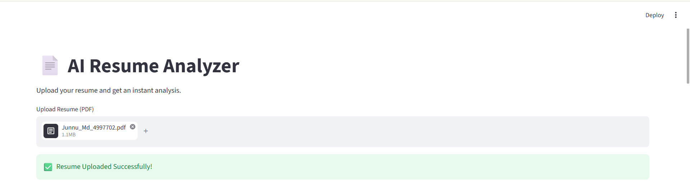
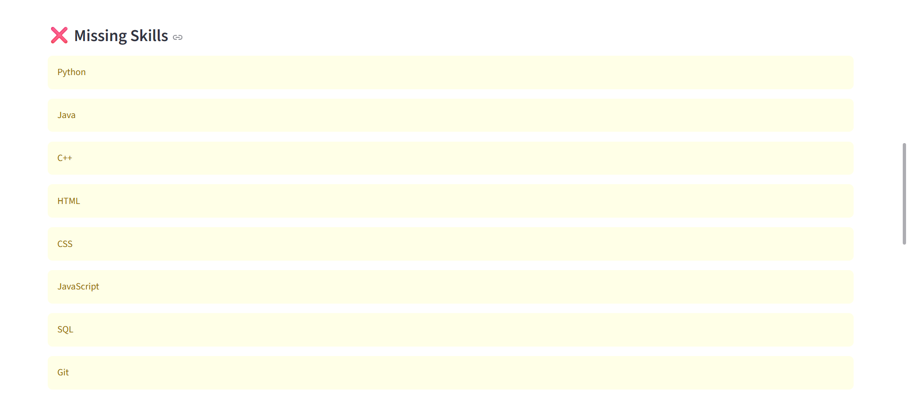

# 📄 AI Resume Analyzer

An AI-powered Resume Analyzer built using Python, Streamlit, and PDFPlumber.

## 🚀 Features

- 📄 Upload Resume (PDF)
- 📝 Extract Resume Text
- 💻 Detect Skills Automatically
- 📊 Resume Score
- ❌ Missing Skills Detection
- 🤖 AI Suggestions
- 💼 Job Role Prediction
- 📥 Download Resume Report

## 🛠️ Technologies Used

- Python
- Streamlit
- PDFPlumber

## 📂 Project Structure

AI-Resume-Analyzer/
│── app.py
│── requirements.txt
│── README.md
│── .gitignore
│── assets/

## ▶️ Installation

```bash
pip install -r requirements.txt
streamlit run app.py
```

## 📸 Screenshots





## 👨‍💻 Author

**Mohammed Abdul Juned**
